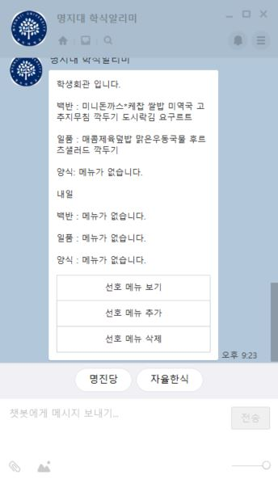
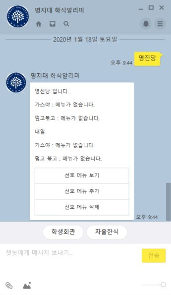

# 🥘 명지대학교 학식 알리미 (카카오톡 챗봇)

* 명지대학교 학식을 크롤링하여 서비스 하는 챗봇입니다. 학생회관, 명진당, 자율한식의 식단을 확인 할 수 있습니다!

* 금주 식단 중, 원하는 메뉴가 포함되어 있는 식단만 보고 싶다면 추가 기능을 이용 해보세요!

# 👨‍💻 적용 기술

* Node.js 로 API를 서버 구현 및 카카오 I 오픈빌더 사용하여 챗봇 제작

# 🔍 챗봇 사용하기

* 카카오톡 친구 추가 (명지대 학식알리미) 

# 📷 사용 예시

* 학식 보기
 *학생회관
 
 
 *명진당
 

 *자율한식
 

* 선호 메뉴 관리 하기

 *선호메뉴 추가
 
 
 *선호메뉴 보기
 
 
 *선호메뉴 삭제
 

# 추가 예정 기능

* 인문캠퍼스 / 자연캠퍼스 구분하여 서비스 제공
* 캠퍼스 별 학식 제공
* 캠퍼스 별 미세먼지 수치 제공
* 캠퍼스 별 공지사항 제공
